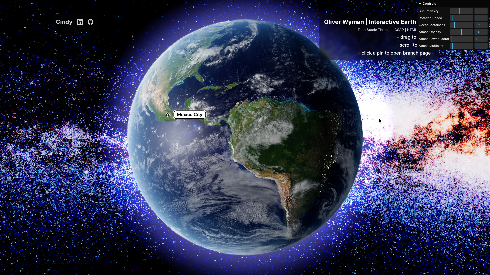

# Oliver Wyman — Interactive Globe

This repository contains a minimal Vite project that implements an interactive globe.
<br>☑ Tech stack: Three.js | JS | CSS | HTML
<br>☑ Locations are pinpoint with a simple circle created using CSS.
<br>☑ Locations' name is displayed around the location pin.
<br>☑ Location pins have clickable CTAs with <a> tag that redirects to the branch’s location website.

---

## Acknowledgement

The Earth globe visuals were inspired by the [threejs-earth](https://github.com/franky-adl/threejs-earth) project by [franky-adl](https://github.com/franky-adl).
I customized the logic to meet the assessment requirements.

---

## Project Structure

```
question-1/
├─ index.html
├─ vite.config.js
├─ package.json
├─ package-lock.json
├─ README.md
├─ .gitignore
├─ public/
│  ├─ demo-thumbnail.jpg
│  ├─ demo-video.mp4
│  └─ assets/
│     ├─ earth_albedo.jpg
│     ├─ earth_bump.jpg
│     ├─ earth_clouds.png
│     ├─ earth_night_lights.png
│     ├─ earth_ocean_mask.png
│     └─ earth_sky_dark.png
└─ src/
   ├─ shaders/
   │  ├─ fragment.glsl
   │  └─ vertex.glsl
   ├─ styles/
   │  └─ styles.css
   ├─ utils/
   │  ├─ common-utils.js
   │  └─ core-utils.js
   ├─ locations.js
   └─ main.js
```

---

## Quick Start

**Requirements**

-   Node.js 18+ (recommended) or any Node.js LTS
-   npm

```bash
git clone https://github.com/cxycode32/earth-globe.git
cd earth-globe/
npm install
npm run dev
```

---

## Demo

[](./public/demo-video.mp4)
